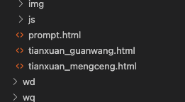
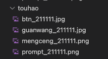

# Hankbook

### 當有落地頁需求時，新增/修改 siteConfig file，透過 shell script 的方式完成

### 修改完後指令：node build.js

#### siteConfig 規則如下：

* guanwangHtmlModule: 模塊名稱
* mengcengHtmlModule: 模塊名稱
* jsModule: 模塊名稱
* title: 落地頁名稱
* siteName: 棋牌拼音名稱
* imgDate: 圖片日期，發需求的當天日期
* jsVersion: 由參數統一決定，若需求有更改既有的 js file，需進版號
* DLName: 這為官網落地頁下載函式名稱，基本為 "download_[棋牌拼音名稱]"
* DLNameOl: 這為推廣落地頁下載函式名稱，基本為 "download_[棋牌拼音名稱] _ol"
* DLAndroidUrl: android 下載鏈接
* DLIOSUrl: ios 下載鏈接
* folderName: 資料夾名稱，基本為拼音名稱縮寫，需跟運維設定名稱相同，可參考 [這裏](https://docs.google.com/spreadsheets/d/1xRPMssVAQSuJ9YuI08pEdYqrKuOsXLs0SDpNyBU13Ms/edit#gid=0)

#### 圖片規則如下：（路徑：src/img）

* 資料夾名稱為，棋牌拼音名稱
* 圖片日期要統一
* 圖片名稱
    * 官網落地頁：參考其他現有棋牌（日期需改成需求當天的日期）

--------------
# 包網落地頁需求申请:


## 更新流程:
1. 確認new分支更新為最新版
2. 找到siteConfig.js修改版號

	```javascript=
	const jsVer = "3.0.162"; //版號
	
	module.exports = [
	    {
	        guanwangHtmlModule: "module1",
	        mengcengHtmlModule: "module1",
	....
	...
	..
	.
	```

3. 找到siteConfig.js對應的落地頁設定。

	```javascript=
	{
	    guanwangHtmlModule: "module1",
	    mengcengHtmlModule: "module1",
	    jsModule: "module1",
	    title: "长留", //透過title找到對應設定
	    siteName: "changliu", //專案名稱(透過title漢語拼音翻譯，無聲調)
	    imgDate: "210714",
	    jsVersion: jsVer,
	    DLName: "download_changliu",
	    DLNameOl: "download_changliu_ol",
	    DLAndroidUrl: "https://zl.nbedun.com/f421c21ee5010293789a8f46ab798349.apk",
	    DLIOSUrl: "https://yclpsj.com/Ja2EG",
	    folderName: "zl" //用來區分dist下對應目錄
	},
	```
4. 改動好之後儲存，並執行"node build.js"
5. 檢查dist目錄產生的檔案
(下載按鈕兩種, 是否顯示殺毒軟體提示)  
ex:  
  
頁面內容檢查畫面中央是否有殺毒提示:  
ex:  
  
6. 檢查謀成頁是否有彈出全螢幕提示  
ex: 
  
7. 檢查下載按鈕是否可以下載app
8. 更新分支 "[專案名稱] + 更新內容" (需依照先前規範commit)  
ex: [xx棋牌]修改官网落地页安卓下载地址
9. 發佈  


## 發佈需求範例:

### 修改下載地址:
部署申请  
项目:  包网项目天选棋牌  
需求: 天选棋牌官网落地页安卓下载地址更换  

部署链接:  官网：  
tx68.vip  
tx88.vip  
tx668.vip  
                  
gitLab:  http://52.220.212.168/package/promotion_page_h5.git  
commit: 2544e4c4  
分支: new

-------------
## 新增落地頁流程:
1. 確認new分支更新為最新版
2. 找到siteConfig.js修改版號

	```javascript=
	const jsVer = "3.0.162"; //版號
	
	module.exports = [
	    {
	        guanwangHtmlModule: "module1",
	        mengcengHtmlModule: "module1",
	....
	...
	..
	.
	```

3. siteConfig.js 最下方新增一個棋牌，(參照上述：siteConfig 規則)

	```javascript=
	{
	    guanwangHtmlModule: "module1",
	    mengcengHtmlModule: "module1",
	    jsModule: "module1",
	    title: "长留", //新增的棋牌名稱(修改)
	    siteName: "changliu", //棋牌名稱(透過title漢語拼音翻譯，無聲調)(修改)
	    imgDate: "210714", //新增當天的日期(修改)
	    jsVersion: jsVer,
	    DLName: "download_changliu", //需修改
	    DLNameOl: "download_changliu_ol", //需修改
	    DLAndroidUrl: "https://zl.nbedun.com/f421c21ee5010293789a8f46ab798349.apk",  //新增的Android URL(修改)
	    DLIOSUrl: "https://yclpsj.com/Ja2EG",  //新增的IOS Url(修改)
	    folderName: "zl" //用來區分dist下對應目錄(修改)
	},
	```
4. 新增圖片資源目錄(src/img/touhao)  
  
命名規則說明:  
圖片類型_[日期]  
類型:  
a. btn: 下載按鈕圖片  
b. guanwang: 主背景圖片  
c. mengceng: 謀成圖片  
d. prompt: 提示圖片
5. 改動好之後儲存，並執行"node build.js"
6. 檢查dist目錄產生的檔案(下載按鈕兩種, 是否顯示殺毒軟體提示)  
ex:  
   
頁面內容檢查畫面中央是否有殺毒提示:  
ex:  
  
7. 檢查謀成頁是否有彈出全螢幕提示  
ex: 
  
8. 檢查下載按鈕是否可以下載app
9. 更新分支 "[專案名稱] + 更新內容" (需依照先前規範commit)  
ex: [xx棋牌]新增官网落地页下载地址
10. 發佈  


## 發佈範例:
### 新增落地頁:
部署申请  
项目: 包网新增项目头号棋牌  
需求: 新增头号棋牌官网落地页

部署链接:官网:  
th21.co  
th21.vip  
th21.fun  

touhao_ guanwang.html  
touhao_mengceng.html
                  
gitLab:  http://52.220.212.168/package/promotion_page_h5.git  
commit: 5f9dcb1c  
分支: new